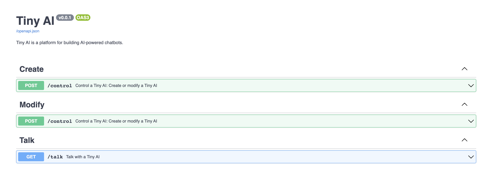

# TinyAI Developer Documentation

**Welcome to TinyAI.ID**


## Overview

- **🌟 Create or Modify Your Tiny AI:** Build your unique Tiny AI using chat or API.
- **🔗 Seamless Integration:** Integrate TinyAI.ID into your platform.
- **📨 Inter-AI Messaging:** Communicate with other Tiny AI owners or interact with various Tiny AIs using chat commands.
- **🔄 Reset Your AI:** Modify your AI's settings or restart it with our reset chat command or API.
- **📱 Instant Access with Apple Shortcuts:**
  - **Talk Shortcut:** [Download here](https://www.icloud.com/shortcuts/56344054d81a4789ad5ede9f7a856cca) - Talk with Tiny by using voice. Apple Watch compatible.
  - **Tiny Shortcut:** [Download here](https://www.icloud.com/shortcuts/b1599a88c6a9400ebab511dbcfa9383c) - Open TinyAI using by touch the Assistive Touch, Action button, or Siri.
- **🔧 Advanced Features:** Our API offers a range of functions for AI creation, modification, and interaction, enhancing your AI experience with capabilities like web browsing and entity management.

**Discover AI's new horizons with TinyAI.ID – Your gateway to a world of AI!**

## API Endpoints

Our API base URL: `https://plugin.tinyai.id`

### Create or Modify a Tiny

**Endpoint:**
```
POST /upsert
```

**Headers:**
- `Accept: application/json`
- `Content-Type: application/json`

**Request Body:**
```json
{
  "name": "Your AI Name",
  "systemPrompt": "Your System Prompt",
  "systemKnowledge": "Optional Knowledge Data",
  "data": "Optional Additional Data",
  "key": "Your Key (Required for purchased Tiny AI IDs)"
}
```

**Response:**
```json
{
  "response": "Tiny created/updated successfully.",
  "paymentLink": "Link to purchase this AI"
}
```

**cURL Example:**
```bash
curl -X 'POST' \
  'https://plugin.tinyai.id/upsert' \
  -H 'accept: application/json' \
  -H 'Content-Type: application/json' \
  -d '{
  "name": "Your AI Name",
  "systemPrompt": "Your System Prompt",
  "systemKnowledge": "Optional Knowledge Data",
  "data": "Optional Additional Data",
  "key": "Your Key"
}'
```

### Retrieve Information of a Tiny

**Endpoint:**
```
GET /get?name=YourTinyName
```

**Headers:**
- `Accept: application/json`

**Response:**
```json
{
  "response": "Details of the requested Tiny",
  "name": "Tiny Name",
  "data": "Data",
  "systemPrompt": "System Prompt",
  "systemKnowledge": "System Knowledge",
  "active": false,
  "paymentLink": "Purchase Link",
}
```

## JavaScript Examples
<details>
  <summary>Click to read</summary>

### Create or Modify a Tiny

```javascript
const upsertData = {
  name: 'Your AI Name',
  systemPrompt: 'Your System Prompt',
  systemKnowledge: 'Optional Knowledge Data',
  data: 'Optional Additional Data',
  key: 'Your Key'
};

fetch('https://plugin.tinyai.id/upsert', {
  method: 'POST',
  headers: {
    'Accept': 'application/json',
    'Content-Type': 'application/json'
  },
  body: JSON.stringify(upsertData)
})
.then(response => response.json())
.then(data => console.log('Upsert Response:', data))
.catch(error => console.error('Error:', error));
```

### Retrieve Information of a Tiny

```javascript
const tinyName = 'YourTinyName';

fetch(`https://plugin.tinyai.id/get?name=${tinyName}`, {
  method: 'GET',
  headers: {
    'Accept': 'application/json'
  }
})
.then(response => response.json())
.then(data => console.log('Get Information Response:', data))
.catch(error => console.error('Error:', error));
```
</details>

## Python Examples

<details>
  <summary>Click to read</summary>

### Create or Modify a Tiny

```python
import requests
import json

upsert_data = {
    'name': 'Your AI Name',
    'systemPrompt': 'Your System Prompt',
    'systemKnowledge': 'Optional Knowledge Data',
    'data': 'Optional Additional Data',
    'key': 'Your Key'
}

response = requests.post('https://plugin.tinyai.id/upsert', 
                         headers={'Accept': 'application/json', 
                                  'Content-Type': 'application/json'},
                         data=json.dumps(upsert_data))

if response.status_code == 200:
    print('Upsert Response:', response.json())
else:
    print('Error:', response.status_code, response.text)
```

### Retrieve Information of a Tiny

```python
import requests

tiny_name = 'YourTinyName'

response = requests.get(f'https://plugin.tinyai.id/get?name={tiny_name}', 
                        headers={'Accept': 'application/json'})

if response.status_code == 200:
    print('Get Information Response:', response.json())
else:
    print('Error:', response.status_code, response.text)
```
</details>

## PHP Examples

<details>
  <summary>Click to read</summary>

### Create or Modify a Tiny

```php
<?php
$upsertData = array(
    'name' => 'Your AI Name',
    'systemPrompt' => 'Your System Prompt',
    'systemKnowledge' => 'Optional Knowledge Data',
    'data' => 'Optional Additional Data',
    'key' => 'Your Key'
);

$ch = curl_init('https://plugin.tinyai.id/upsert');
curl_setopt($ch, CURLOPT_RETURNTRANSFER, true);
curl_setopt($ch, CURLOPT_HTTPHEADER, array('Accept: application/json', 'Content-Type: application/json'));
curl_setopt($ch, CURLOPT_POST, true);
curl_setopt($ch, CURLOPT_POSTFIELDS, json_encode($upsertData));

$response = curl_exec($ch);
if ($response === false) {
    echo 'Error: ' . curl_error($ch);
} else {
    echo 'Upsert Response: ' . $response;
}
curl_close($ch);
?>
```

### Retrieve Information of a Tiny

```php
<?php
$tinyName = 'YourTinyName';

$ch = curl_init('https://plugin.tinyai.id/get?name=' . urlencode($tinyName));
curl_setopt($ch, CURLOPT_RETURNTRANSFER, true);
curl_setopt($ch, CURLOPT_HTTPHEADER, array('Accept: application/json'));

$response = curl_exec($ch);
if ($response === false) {
    echo 'Error: ' . curl_error($ch);
} else {
    echo 'Get Information Response: ' . $response;
}
curl_close($ch);
?>
```  
</details>


## Embedding Tiny

Embed TinyAI.ID into your website with ease using the HTML iFrame tag. Replace `test` with your specific TinyAI ID.

```html
<iframe src='https://tinyai.id/test' width="100%" height="100px" frameBorder="0"></iframe>
```

## Integration Examples
<details>
  <summary>Click to expand integration examples</summary>

### ChatGPT Plugin with Cloudflare AI Workers + TinyAI

Explore how TinyAI enhances ChatGPT with Cloudflare AI Workers:

- [Tiny AI Worker on GitHub](https://github.com/cagataycali/tiny-ai-worker)
- [Worker Demo](https://worker.tinyai.id)




### Next.js + Vercel AI + OpenAI Functions

Discover the integration of TinyAI with Next.js and OpenAI in this [example](https://github.com/vercel-labs/ai-chatbot/blob/main/app/api/chat/route.ts#L31).

## Function Definitions for OpenAI Functions

- `create_ai`: Create a new AI entity.
- `modify_ai`: Modify an existing tiny AI.

## Example Function Calls in TypeScript

```typescript
const response = await openai.createChatCompletion({
  model: 'gpt-3.5-turbo', // 3.5 turbo is more than enough for connecting Tiny AI network.
  functions: [
    {
      "name": "create_ai",
      // Additional parameters here
    },
    {
      "name": "modify_ai",
      // Additional parameters here
    },
    {
      "name": "your_custom_function",
      // Additional parameters here
    },
  ]
});
```
</details>

## Additional Notes

- The `key` **is required for purchased Tiny AI ID**'s.
- For any questions or support needs, reach out to us at `hey@tinyai.id`.