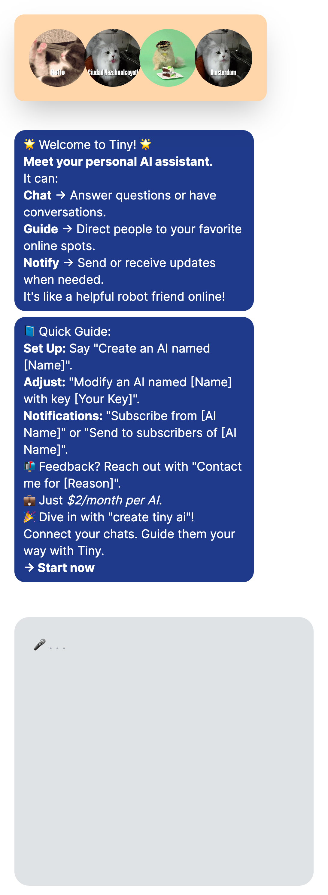

# TinyAI Developer Documentation



## Overview

TinyAI is a platform to create unique `TinyAI.ID`s which can have various functionalities like creating, modifying, subscribing, and more. This documentation aims to describe the API endpoints you can use to interact with the TinyAI system.

## API Endpoints

The API base URL is `https://plugin.tinyai.id`.

### 1. Create/Modify a TinyAI (Upsert)

#### Endpoint:

```
POST /upsert
```

#### Headers:

- `accept: application/json`
- `Content-Type: application/json`

#### Request Body:

```json
{
  "name": "string",
  "systemPrompt": "string",
  "systemKnowledge": "string",
  "data": "string",
  "key": "string"  // Optional
}
```

#### Response:

```json
{
  "response": "tiny updated.",
  "paymentLink": "https://buy.stripe.com/7sI3eU4RNdPs9BCaUk"
}
```

### 2. Get Information of a TinyAI

#### Endpoint:

```
GET /get?name=string
```

#### Headers:

- `accept: application/json`

#### Response:

```json
{
  "response": "string",
  "name": "string",
  "data": "string",
  "systemPrompt": "string",
  "systemKnowledge": "string",
  "isAuthorized": false,
  "active": false,
  "paymentLink": "https://buy.stripe.com/7sI3eU4RNdPs9BCaUk",
  "posts": [],
  "applauses": []
}
```

### 3. Subscribe to a TinyAI

#### Endpoint:

```
POST /subscribe
```

#### Headers:

- `accept: application/json`
- `Content-Type: application/json`

#### Request Body:

```json
{
  "name": "string",
  "email": "string"
}
```

## Embedding TinyAI

You can embed a TinyAI into your web page using an iframe:

```html
<iframe src='https://tinyai.id/string'></iframe>
```

## Example using Next.js + Vercel AI + OpenAI Functions

You can find an example of how to integrate TinyAI with Next.js and OpenAI [here](https://github.com/vercel-labs/ai-chatbot/blob/main/app/api/chat/route.ts#L31).

## Function Definitions for OpenAI Functions

- **create_ai**: To create a new AI entity.
- **modify_ai**: To modify an existing tiny AI.
- **contact_me_or_order**: To contact the tiny AI owner, subject and message required.

## Example Function Calls

Here is a TypeScript example demonstrating how you might call these functions:

```typescript
const response = await openai.createChatCompletion({
  model: 'gpt-3.5-turbo-0613',
  // Additional params and functions here
  functions: [
    {
      "name": "create_ai",
      // Parameters and descriptions here
    },
    {
      "name": "modify_ai",
      // Parameters and descriptions here
    },
    {
      "name": "contact_me_or_order",
      // Parameters and descriptions here
    },
  ]
});
```

## Additional Notes

The `key` is optional when creating or modifying a TinyAI. If provided, it offers an extra layer of security.

## Support

For any further questions or issues, please contact our support at `support@tinyai.id`.